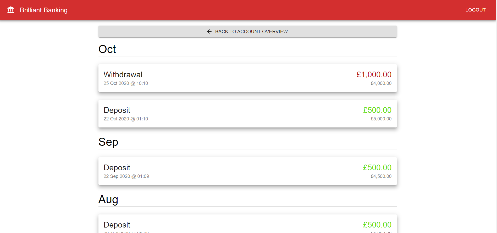
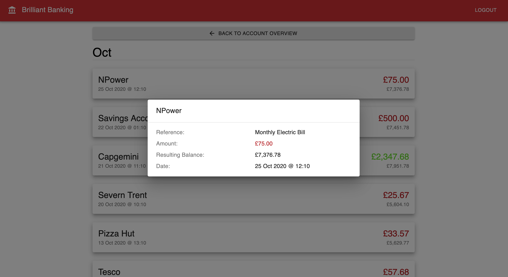

This is the UI for the Brilliant Banking application. Follow the instructions below to get started, then read on to see the challenges!

# Getting Started
1. Install NodeJS version 14+ from the [NodeJS Website](https://nodejs.org/en/)
2. Install Docker from the [Docker Website](https://docs.docker.com/get-docker/)
    * If you are on Linux you will also need to install [docker-compose](https://docs.docker.com/compose/install/)
4. Clone this repo
5. Run `npm i`
6. Run the Pact Mock of the server: `npm run startMockServer`
7. In another terminal run the UI: `npm start`
8. Navigate to `http://localhost:3000` in your browser

# Environment Variables
The necessary variables are defaulted in the `.env` and do not need to be changed when running a standard local setup.

* REACT_APP_SERVER_HOSTNAME - The full URL for the backend server
* PACT_BROKER_URL - The URL of the Pact Broker, where contracts published
* PACT_BROKER_TOKEN - The API token for the Pact Broker

# A Few Concepts
* [React Overview](docs/ReactOverview.md)
* [Pact Overview]()

# Challenges
## 1. Display Transactions Sorted & Grouped by Month

This is what you are aiming for:



1. Start by running the tests, one should fail...
```
npm run test
```

2. Now time to make them pass! Firstly Load the transactions from the server, using Redux Toolkit
    * Start off by opening [transactions.js](./src/store/transactions.js)
    * Address the TODO comments on line 38

3. Next ensure the Pact tests pass, in particular the [transactions.test.js](./src/pact/transactions.test.js), you can run that specific test like this:
```
npm run test transactions.test.js
```

4. Now create the Account Details view to display the transactions, this will involve making a new React Component
    * Open [AccountDetails.js](./src/views/AccountDetails.js)
    * You need to replace the placeholder on line 48 with the account transactions
    * [Overview.js](./src/views/Overview.js) has a loop to display the accounts, you can use similar logic, however you will need to do a little more as the transactions are grouped by month
    * You should make a new "TransactionCard" component, this will be similar to the [AccountCard.js](./src/components/AccountCard.js)
    * **Tip:** Start by getting something simple on the page, then go from there!

5. Once you are happy you can stop the Pact mock server and run the real one!
    * Start the backend server, following the [brilliant-banking-server-devoxx](https://github.com/nighk/brilliant-banking-server-devoxx) README
    * Refresh the UI, then login with the username of `user` and password of `iLoveDevoxx`

6. Bonus points for writing tests for your changes / new components

## 2. Display transaction details



We need another screen where people can drill into the details of their transaction. Currently there is only one additional property called `reference` that isn't shown, however more may be added in the future. So try and create a screen that could also cater for additional information. One idea is to create a popup when a card is clicked like the screenshot below, but equally you could make a separate page as well.

Anything you make should be a new component, that is opened when a user clicks on a transaction.

**Hint:** To speed up development here are a full list of the properties on each transaction object:
* type (valid values are `in` or `out`)
* dateTime
* amount
* accountBalance (after transaction)
* title
* reference

## 3. Further Improvements

How else could this tutorial/challenge be improved? Pull requests are welcome!

## Additional Material

If you are interested in trying out Pact more then you can sign up to [Pactflow](https://pactflow.io/). Once you have done that grab an API token and try publishing the Pact Contracts from this repo:

1. Set the following information in the [.env](.env):
```
PACT_BROKER_URL=https://<username>.pactflow.io/
PACT_BROKER_TOKEN=<token>
```

2. Run an `npm test` to create the contracts, this uses jest-pact. They are then stored under [pact/pacts](pact/pacts).

3. Publish the contracts by running:
```
npm run publishPacts
```

4. View the contracts in your Pact Broker account e.g. https://\<username>.pactflow.io/

5. Run them against the [brilliant-banking-server-devoxx](https://github.com/nighk/brilliant-banking-server-devoxx):

Within the server repo add the following to the `.env`:
```
PACT_BROKER_URL=https://<username>.pactflow.io/
PACT_BROKER_TOKEN=<token>
```

Then simply run:
```
npm run test
```

6. This has now verified that the server provides the correct endpoints and behaviour for the UI. This can be automated with a CI tool to provide confidence in the interactions between your microservices!