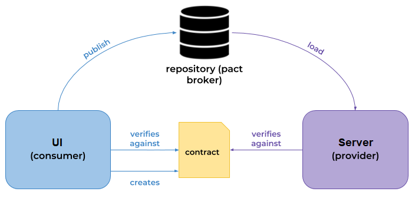

# Pact
* Pact is a contract testing framework
* It is designed to test interactions between microservices in isolation
* Tests are driven by the consumer e.g. a UI is a consumer, whatever is providing the interface is the producer
    * The consumer creates a contract based off the calls it wants to make
    * The contract is then replayed against the producer, to make sure it published the interfaces the UI needs 
* It can make development easier by providing mock interfaces, these are made from the contract so you know they are correct
* Contracts are versioned and published to a Pact Broker, much like a git repo but for Pact Contracts

