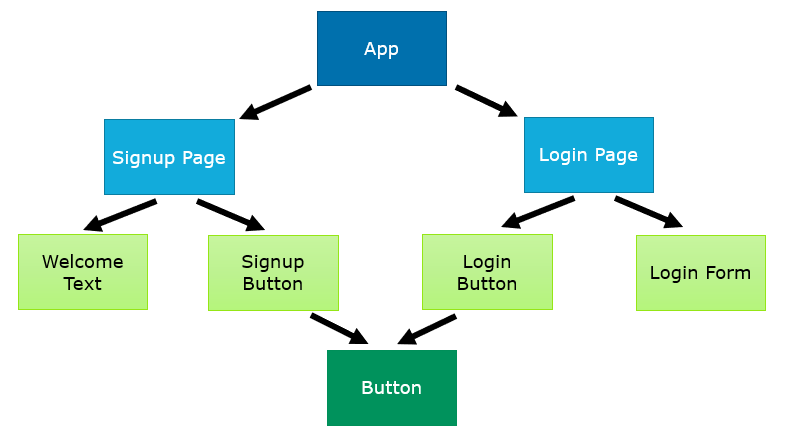
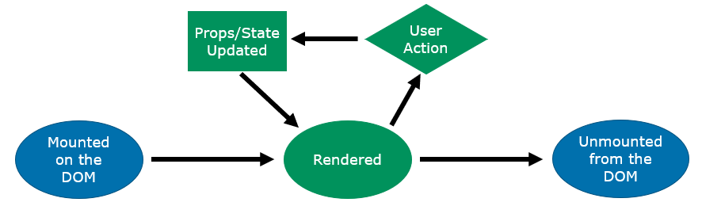

# React
* React is a library for development of single page web applications
* Each part of a React application is split into components
* Each component is written in JSX (HTML & Javascript combined)
* Small function based components are the way to go!
* Use hooks to give you stateful behaviour
* Global state libraries can be used to save you from props tree trap!
* There are loads of libraries out there, always google before implementing something yourself ;-)

## Component Tree
A React Component Tree might look like this:

## The Render Cycle
* In the background React efficiently re-renders your components on the page
* It only re-renders the parts of the page that it needs to
* Individual components will be re-rendered when their props or state values change
